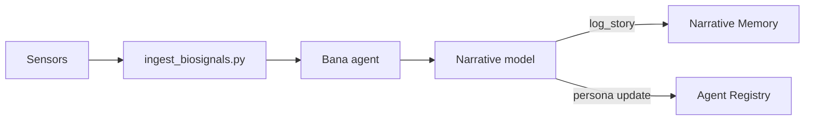

# Nazarick Narrative System

This guide explains how story events are routed through Nazarick, linking each
event to a servant agent and the memory layer that preserves it. Biosignals and
other inputs become `StoryEvent` objects that feed agent personas and drive
future behaviour.

## Architecture



`log_story` persists each event to the [narrative memory](memory_architecture.md)
while a light‑weight summary is sent to the agent registry so servants can shift
their persona traits.

## Event–Agent Map

| event action        | servant agent             | memory layer   |
|--------------------|---------------------------|----------------|
| elevated heart rate | `bio_adaptive_narrator`   | narrative      |
| calm                | `harmonic_sentinel`       | emotional      |
| spike in EDA        | `battle_scribe`           | mental         |

Agents listed above live in [`agents/nazarick`](../agents/nazarick) and declare
their chakra alignment in [`agent_registry.yaml`](../agents/nazarick/agent_registry.yaml).
The memory layers are defined in [Memory Architecture](memory_architecture.md).

## Dataset Example

Sample rows illustrating how story events are captured:

```json
{
  "timestamp": "2025-09-14T10:15:00Z",
  "heart_rate": 82.0,
  "skin_temp": 33.1,
  "eda": 0.42,
  "agent": "bio_adaptive_narrator",
  "memory_layer": "narrative",
  "action": "elevated heart rate"
}
{
  "timestamp": "2025-09-14T10:16:30Z",
  "heart_rate": 68.0,
  "skin_temp": 32.8,
  "eda": 0.12,
  "agent": "harmonic_sentinel",
  "memory_layer": "emotional",
  "action": "calm"
}
```

Dataset entries may be appended to `data/biosignals/events.jsonl` for training
and replay. The `agent` and `memory_layer` fields direct downstream routing.

## Persona Impact

When events are logged, a compact summary is emitted to the agent registry. The
registry increments counters for the originating agent and adjusts
`persona_traits`—for example, repeated **elevated heart rate** events raise the
"vigilant" trait for `bio_adaptive_narrator`. These traits are referenced during
dialogue generation, allowing servants to evolve personalities grounded in the
recorded narrative stream.

## Tests

Validate the ingestion and mapping pipeline:

```bash
pytest tests/narrative_engine/test_biosignal_pipeline.py \
       tests/narrative_engine/test_biosignal_transformation.py
```
