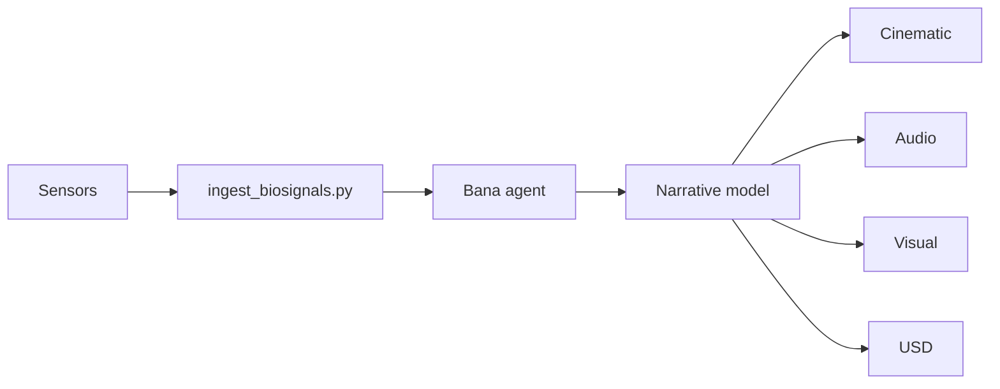

# Nazarick Narrative System

This guide outlines how biosignals become narrative events within the Nazarick domain.

## Architecture


## Dependencies
- `data/biosignals/` – sample datasets for testing and development.
- `scripts/ingest_biosignals.py` – converts biosignal rows into narrative actions.
- `memory/narrative_engine.py` – defines `StoryEvent` and `log_story` storage.

## Schema
| column | type | unit |
| --- | --- | --- |
| `timestamp` | ISO 8601 UTC | - |
| `heart_rate` | float | BPM |
| `skin_temp` | float | °C |
| `eda` | float | µS |

## Ingestion
1. Run `python scripts/ingest_biosignals.py` to process CSV files in `data/biosignals/`.
2. Each row becomes a `StoryEvent` where the action is **elevated heart rate** if `heart_rate` > 74 BPM, otherwise **calm**.
3. Events are stored via `log_story` for downstream consumption by narrative models.

## Sample Event Flow
1. Sensors emit heart rate, skin temperature, and electrodermal activity readings.
2. `ingest_biosignals.py` reads each CSV row and labels the action as **elevated heart rate** when BPM exceeds 74, otherwise **calm**.
3. A `StoryEvent` is created for each row and recorded via `log_story` for later retrieval.

## Tests

Validate the ingestion pipeline:

```bash
pytest tests/narrative_engine/test_biosignal_pipeline.py \
       tests/narrative_engine/test_biosignal_transformation.py
```
