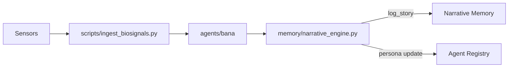

# Nazarick Narrative System

This guide explains how biosignals become `StoryEvent` objects inside Nazarick.
Each event links to a servant agent and is persisted across the
[memory architecture](memory_architecture.md).

## Biosignal→StoryEvent Pipeline



1. **Sensors** capture heart rate, skin temperature, and EDA.
2. **`scripts/ingest_biosignals.py`** normalizes samples and emits structured
   records.
3. **`agents/bana/bio_adaptive_narrator.py`** transforms records into
   `StoryEvent` objects.
4. **`memory/narrative_engine.py`** logs events to persistent stores and emits
   persona summaries.

## Memory Layer Hooks

Hooks link each `StoryEvent` to specific layers described in
[Memory Architecture](memory_architecture.md).

| layer     | hook function  | module |
|-----------|---------------|--------|
| cortex    | `record_spiral` | [`memory/cortex.py`](../memory/cortex.py) |
| emotional | `log_emotion`   | [`memory/emotional.py`](../memory/emotional.py) |
| narrative | `log_story`     | [`memory/narrative_engine.py`](../memory/narrative_engine.py) |

## Modules

Core modules participating in the pipeline:

- [`scripts/ingest_biosignals.py`](../scripts/ingest_biosignals.py)
- [`agents/bana/bio_adaptive_narrator.py`](../agents/bana/bio_adaptive_narrator.py)
- [`memory/cortex.py`](../memory/cortex.py)
- [`memory/emotional.py`](../memory/emotional.py)
- [`memory/narrative_engine.py`](../memory/narrative_engine.py)

## Event–Agent Map

| event action        | servant agent             | memory layer   |
|--------------------|---------------------------|----------------|
| elevated heart rate | `bio_adaptive_narrator`   | narrative      |
| calm                | `harmonic_sentinel`       | emotional      |
| spike in EDA        | `battle_scribe`           | mental         |

Agents listed above live in [`agents/nazarick`](../agents/nazarick) and declare
their chakra alignment in [`agent_registry.yaml`](../agents/nazarick/agent_registry.yaml).
The memory layers are defined in [Memory Architecture](memory_architecture.md).

## Dataset Example

Sample rows illustrating how story events are captured:

```json
{
  "timestamp": "2025-09-14T10:15:00Z",
  "heart_rate": 82.0,
  "skin_temp": 33.1,
  "eda": 0.42,
  "agent": "bio_adaptive_narrator",
  "memory_layer": "narrative",
  "action": "elevated heart rate"
}
{
  "timestamp": "2025-09-14T10:16:30Z",
  "heart_rate": 68.0,
  "skin_temp": 32.8,
  "eda": 0.12,
  "agent": "harmonic_sentinel",
  "memory_layer": "emotional",
  "action": "calm"
}
```

Dataset entries may be appended to `data/biosignals/events.jsonl` for training
and replay. The `agent` and `memory_layer` fields direct downstream routing.

## Persona Impact

When events are logged, a compact summary is emitted to the agent registry. The
registry increments counters for the originating agent and adjusts
`persona_traits`—for example, repeated **elevated heart rate** events raise the
"vigilant" trait for `bio_adaptive_narrator`. These traits are referenced during
dialogue generation, allowing servants to evolve personalities grounded in the
recorded narrative stream.

## Tests

Validate the ingestion and mapping pipeline:

```bash
pytest tests/narrative_engine/test_biosignal_pipeline.py \
       tests/narrative_engine/test_biosignal_transformation.py
```

## Version History

| Version | Date | Summary |
|---------|------|---------|
| 0.1.0 | 2025-10-17 | Documented biosignal pipeline, memory hooks, and modules. |
