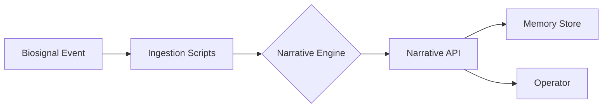

# Nazarick Narrative System

The Nazarick Narrative System converts biosignals into narrative events and persistent memory records.

## Architecture Diagram



## Dataset Schema

Biosignal samples are stored as CSV or JSON Lines with the following fields:

| column | type | unit |
| --- | --- | --- |
| `timestamp` | ISO 8601 UTC | - |
| `heart_rate` | float | BPM |
| `skin_temp` | float | °C |
| `eda` | float | µS |

See [data/biosignals/README.md](../data/biosignals/README.md) for collection and anonymization guidelines.

## Event Flow

1. Sensors produce anonymized biosignals at 1 Hz.
2. `scripts/ingest_biosignals.py` transforms rows into descriptive story events via `narrative_engine`.
3. `narrative_api` exposes `POST /story` for logging events and `GET /story/log` and `GET /story/stream` for retrieval.
4. Logged stories persist in narrative memory and can be streamed to operators or other agents.

## Narrative Log Format

Each event produces two lines in `logs/nazarick_story.log`:

1. A prose sentence tailored by the agent persona.
2. A JSON object capturing the event:

```json
{"agent_id": "<agent>", "event_type": "<type>", "text": "<prose>"}
```

## Story Index

The JSON line is also inserted into the `story_index` table within
`memory/narrative_engine.db`. Entries are keyed by `agent_id` and the event
timestamp and include the narrative text and `event_type` for efficient lookup.
