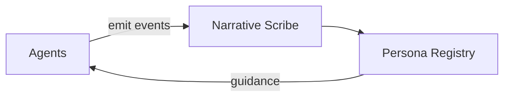

# Nazarick Narrative System

## Requirements

Core dependencies:

- `pydantic`
- `sqlite3`

Optional tools:

- `mermaid` — for rendering text-based diagrams

## Architecture

The narrative system links agents to shared memory components. Agents emit events that the narrative scribe records and
forwards to the persona registry, which updates traits and feeds guidance back to agents. The flow below is expressed using
Mermaid and avoids binary assets.



## Narrative Scribe
The narrative scribe records events that occur within Nazarick. It collects structured notes from the agents, preserves context, and threads new entries into the ongoing chronicle so future servants can reference past actions.

## Persona Registry
The persona registry catalogs known personas and their traits. When a new persona is invoked, the registry ensures consistent voice and behavior by retrieving stored attributes and updating them with fresh observations.

## Event Flow
1. Agents emit events as they interact.
2. The narrative scribe captures the event and links it to the relevant persona entry.
3. The persona registry updates stored traits and returns guidance to agents.
4. Downstream systems consume the enriched narrative for memory, analysis, or storytelling.

Example event entry:

```json
{
  "agent": "albedo",
  "action": "greeting",
  "timestamp": "2025-01-01T12:00:00Z",
  "context": {"location": "throne_room"}
}
```

The narrative scribe and persona registry operate together to maintain a coherent history of activities across Nazarick.
