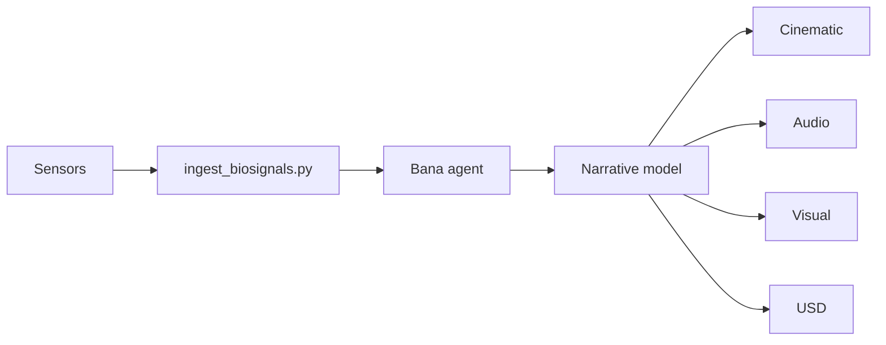

# Nazarick Narrative System

This guide outlines how biosignals become narrative events within the Nazarick domain.

## Architecture

## Dependencies
- `data/biosignals/` – sample datasets for testing and development.
- `scripts/ingest_biosignals.py` – converts biosignal rows into narrative actions.
- `memory/narrative_engine.py` – defines `StoryEvent` and `log_story` storage.

## Sample Event Flow
1. Sensors emit heart rate, skin temperature, and electrodermal activity readings.
2. `ingest_biosignals.py` reads each CSV row and labels the action as **elevated heart rate** when BPM exceeds 74, otherwise **calm**.
3. A `StoryEvent` is created for each row and recorded via `log_story` for later retrieval.
