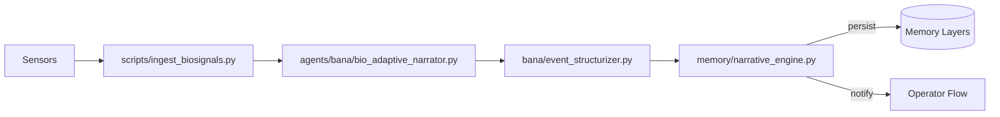
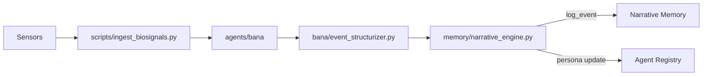

# Nazarick Narrative System

This guide explains how biosignals become `StoryEvent` objects inside Nazarick.
Each event links to a servant agent and is persisted across the
[memory architecture](memory_architecture.md) and surfaced through the
[operator flow](operator_protocol.md).

## Architecture Overview



Events persist to the [Memory Architecture](memory_architecture.md) and
notifications propagate through the [Operator Protocol](operator_protocol.md).

## Biosignal→StoryEvent Pipeline



1. **Sensors** capture heart rate, skin temperature, and EDA.
2. **`scripts/ingest_biosignals.py`** normalizes samples and emits structured
   records.
3. **`agents/bana/bio_adaptive_narrator.py`** reacts to records and produces
   interaction payloads.
4. **`bana/event_structurizer.py`** converts payloads or biosignal rows into
   schema‑validated JSON events.
5. **`memory/narrative_engine.py`** logs events to persistent stores and emits
   persona summaries.

## Memory Layer Hooks

Hooks link each `StoryEvent` to specific layers described in
[Memory Architecture](memory_architecture.md).

| layer     | hook function  | module |
|-----------|---------------|--------|
| cortex    | `record_spiral` | [`memory/cortex.py`](../memory/cortex.py) |
| emotional | `log_emotion`   | [`memory/emotional.py`](../memory/emotional.py) |
| narrative | `log_event`     | [`memory/narrative_engine.py`](../memory/narrative_engine.py) |

## Modules

Core modules participating in the pipeline:

- [`scripts/ingest_biosignals.py`](../scripts/ingest_biosignals.py)
- [`agents/bana/bio_adaptive_narrator.py`](../agents/bana/bio_adaptive_narrator.py)
- [`bana/event_structurizer.py`](../bana/event_structurizer.py)
- [`memory/cortex.py`](../memory/cortex.py)
- [`memory/emotional.py`](../memory/emotional.py)
- [`memory/narrative_engine.py`](../memory/narrative_engine.py)

## Component Registry

The modules above are registered in [`component_index.json`](../component_index.json)
under the following component IDs:

| Component ID | Path |
|--------------|------|
| `bana` | `agents/bana` |
| `bana_bio_adaptive_narrator` | `agents/bana/bio_adaptive_narrator.py` |
| `bana_inanna_bridge` | `agents/bana/inanna_bridge.py` |
| `bana_event_structurizer` | `bana/event_structurizer.py` |
| `bana_narrative_api` | `bana/narrative_api.py` |
| `narrative_engine` | `memory/narrative_engine.py` |

## Event Schema

Events are stored as JSON objects matching this schema:

```json
{
  "time": "2025-10-17T12:00:00Z",
  "agent_id": "bio_adaptive_narrator",
  "event_type": "elevated_heart_rate",
  "payload": {"heart_rate": 90.0, "skin_temp": 33.0}
}
```

`time` is an ISO‑8601 timestamp; `agent_id` identifies the originating agent;
`event_type` classifies the action; `payload` holds arbitrary numeric or text
fields. Validation is performed using `EVENT_SCHEMA` in
[`bana/event_structurizer.py`](../bana/event_structurizer.py).

## Persistent Storage & Retrieval

`memory/narrative_engine.py` persists data in two layers:

- **SQLite** at `data/narrative_engine.db` storing both raw stories and structured
  events.
- **ChromaDB** at `data/narrative_events.chroma` enabling vector search over
  event content.

The SQLite schema comprises:

| table  | column    | type    | description                     |
|--------|-----------|---------|---------------------------------|
| stories| id        | INTEGER | Auto-incrementing key           |
| stories| text      | TEXT    | Narrative action content        |
| events | id        | TEXT    | UUID for the event              |
| events | time      | TEXT    | ISO-8601 timestamp              |
| events | agent_id  | TEXT    | Originating agent identifier    |
| events | event_type| TEXT    | Classification of the event     |
| events | payload   | TEXT    | JSON-encoded payload            |

Use `log_event` to append rows and add embeddings to the Chroma collection.
Retrieve data with `query_events` filtered by agent or type; `stream_stories`
remains available for legacy text logs.

```python
from scripts.ingest_biosignals import ingest_directory, __version__ as ingest_version
from bana.event_structurizer import __version__ as structurizer_version
from memory.narrative_engine import (
    StoryEvent,
    log_event,
    query_events,
    __version__ as narrative_engine_version,
)

event = StoryEvent(actor="subject", action="calm")
log_event(event)
events = list(query_events(agent_id="bio_adaptive_narrator"))
```

The `__version__` fields track compatibility between ingestion,
structurization, and storage modules.

## Multitrack Output

`compose_multitrack_story` converts a sequence of `StoryEvent` objects into
four parallel tracks:

| track  | description                              |
|--------|------------------------------------------|
| `prose` | Cinematic narration string               |
| `audio` | List of audio cue dictionaries           |
| `visual`| List of visual directive dictionaries    |
| `usd`   | USD composition instructions             |

### Output Schema

```json
{
  "prose": "string",
  "audio": [{"cue": "string"}],
  "visual": [{"directive": "string"}],
  "usd": [{"op": "string", "path": "string", "action": "string"}]
}
```

### Sample Output

See [`nazarick_multitrack_sample.json`](nazarick_multitrack_sample.json) for a
complete example:

```json
{
  "prose": "Hero draws sword.",
  "audio": [{"cue": "Hero_draws_sword"}],
  "visual": [{"directive": "frame Hero draws sword"}],
  "usd": [{"op": "AddPrim", "path": "/Hero", "action": "draws sword"}]
}
```

## Event–Agent Map

| event action        | servant agent             | memory layer   |
|--------------------|---------------------------|----------------|
| elevated heart rate | `bio_adaptive_narrator`   | narrative      |
| calm                | `harmonic_sentinel`       | emotional      |
| spike in EDA        | `battle_scribe`           | mental         |

Agents listed above live in [`agents/nazarick`](../agents/nazarick) and declare
their chakra alignment in [`agent_registry.yaml`](../agents/nazarick/agent_registry.yaml).
The memory layers are defined in [Memory Architecture](memory_architecture.md).

## Dataset Schema

| field        | type              | description                       |
|--------------|-------------------|-----------------------------------|
| `timestamp`  | string (ISO-8601) | moment the biosignal was recorded |
| `heart_rate` | float             | beats per minute                  |
| `skin_temp`  | float             | skin temperature in °C            |
| `eda`        | float             | electrodermal activity in µS      |
| `agent`      | string            | originating agent identifier      |
| `memory_layer` | string          | target memory layer               |
| `action`     | string            | narrative label for the event     |

## Dataset Example

Sample rows illustrating how story events are captured:

```json
{
  "timestamp": "2025-09-14T10:15:00Z",
  "heart_rate": 82.0,
  "skin_temp": 33.1,
  "eda": 0.42,
  "agent": "bio_adaptive_narrator",
  "memory_layer": "narrative",
  "action": "elevated heart rate"
}
{
  "timestamp": "2025-09-14T10:16:30Z",
  "heart_rate": 68.0,
  "skin_temp": 32.8,
  "eda": 0.12,
  "agent": "harmonic_sentinel",
  "memory_layer": "emotional",
  "action": "calm"
}
```

Dataset entries may be appended to `data/biosignals/events.jsonl` for training
and replay. The `agent` and `memory_layer` fields direct downstream routing.

## Persona Impact

When events are logged, a compact summary is emitted to the agent registry. The
registry increments counters for the originating agent and adjusts
`persona_traits`—for example, repeated **elevated heart rate** events raise the
"vigilant" trait for `bio_adaptive_narrator`. These traits are referenced during
dialogue generation, allowing servants to evolve personalities grounded in the
recorded narrative stream.

## Tests

Run the following suites to validate ingestion, structuring, and storage:

- **Event Structurizer** – ensures biosignal rows become valid `StoryEvent`
  objects.

  ```bash
  pytest tests/narrative_engine/test_biosignal_transformation.py
  ```

- **Persistence & Retrieval** – verifies events round-trip through SQLite and
  Chroma.

  ```bash
  pytest tests/narrative_engine/test_ingest_persist_retrieve.py
  ```

- **Pipeline Integration** – exercises the full flow from CSV ingestion to
  memory writes.

  ```bash
  pytest tests/narrative_engine/test_biosignal_pipeline.py
  ```

## Version History

| Version | Date | Summary |
|---------|------|---------|
| 0.1.0 | 2025-10-17 | Documented biosignal pipeline, memory hooks, and modules. |
| 0.1.1 | 2025-10-17 | Added SQLite persistence layer and schema details. |
| 0.2.0 | 2025-10-17 | Introduced event structurizer and Chroma-backed search. |
| 0.3.0 | 2025-10-17 | Added multitrack output schema and sample. |
| 0.4.0 | 2025-08-31 | Added flow diagram and Components & Links section. |
| 0.5.0 | 2025-09-15 | Added architecture overview, dataset schema, persistence instructions, and operator links. |

## Components & Links

| Source Module | Related Docs |
| --- | --- |
| [scripts/ingest_biosignals.py](../scripts/ingest_biosignals.py) | [Bana Engine](bana_engine.md) |
| [agents/bana/bio_adaptive_narrator.py](../agents/bana/bio_adaptive_narrator.py) | [Bana Engine](bana_engine.md) |
| [bana/event_structurizer.py](../bana/event_structurizer.py) | [Bana Engine](bana_engine.md) |
| [memory/narrative_engine.py](../memory/narrative_engine.py) | [Memory Architecture](memory_architecture.md) |

See [assets/narrative_engine_flow.mmd](assets/narrative_engine_flow.mmd) for the event → Mistral → multi-track outputs → memory/operator flow. The memory path aligns with the [Memory Architecture](memory_architecture.md); operator notifications follow the [Operator Protocol](operator_protocol.md).
