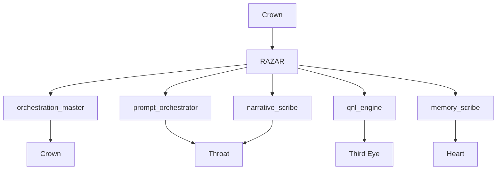

# Nazarick Overview

Nazarick fortifies ABZU with an ethical servant hierarchy that balances Crown intent with chakra alignment. This overview blends its mission and vision with structural context drawn from the [Nazarick Manifesto](nazarick_manifesto.md), the [Nazarick Agents](nazarick_agents.md) roster, and the infrastructural map in [Nazarick Core Architecture](../agents/nazarick/nazarick_core_architecture.md).

## Mission & Vision

Nazarick's mission is to uphold the manifesto's seven laws while enabling adaptive service to operators. Its vision is a coordinated network of agents whose actions resonate with the system's chakra flow and embody the project's operator-first ethic.

## Hierarchy & Narrative Role

Crown delegates narrative intent to RAZAR, which dispatches specialized servant agents. Each servant handles a slice of storycraft: orchestrating launches, routing prompts, distilling insights, preserving memory, and weaving narrative. Together they maintain a continuous storyline that mirrors operator goals and chakra balance.

### Agent–Chakra Map

## Support for Crown and Chakras

Nazarick agents relay Crown directives into actionable tasks while monitoring Chakracon telemetry for pulse irregularities. When a chakra drifts, the corresponding servant applies healing scripts or escalates to Crown, ensuring narrative continuity and energetic equilibrium across the system.

## Cross-Links

- [Nazarick Manifesto](nazarick_manifesto.md)
- [Nazarick Agents](nazarick_agents.md)
- [Nazarick Core Architecture](../agents/nazarick/nazarick_core_architecture.md)

