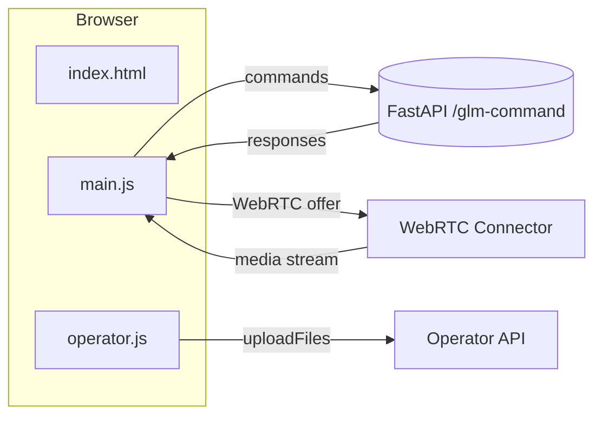
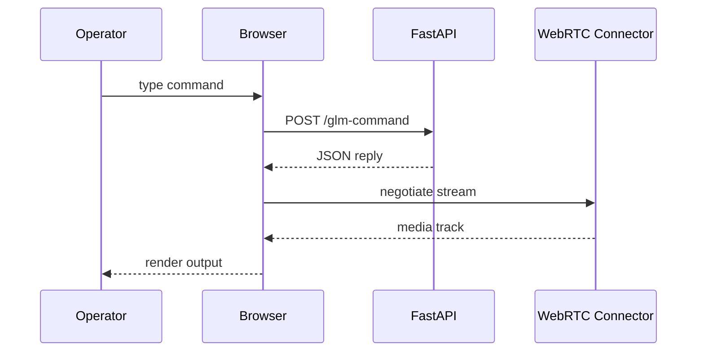

# Nazarick Web Console

The Nazarick Web Console provides a browser-based interface for issuing commands, streaming the avatar, and testing music generation. It talks to the same FastAPI services used by agents and is intended for local development.

## Interaction Diagram





## UI Components

- **`web_console/index.html`** – static page that loads the console and basic styles.
- **`web_console/main.js`** – handles command dispatch, emotion glyphs, music prompts, and WebRTC streaming.
- **`web_console/operator.js`** – helper module exposing `sendCommand`, `startStream`, and `uploadFiles` utilities for operator dashboards.

## Dependencies

- Python 3 for serving static files with `http.server`.
- Modern browser with WebRTC, `fetch`, and MediaDevices APIs.
- Spiral OS backend providing the `/glm-command` and `/offer` endpoints.
- [WebRTC Connector](../connectors/webrtc_connector.py) and [Operator API](../operator_api.py) for streaming and file uploads. See the [Connector Index](connectors/CONNECTOR_INDEX.md) for a full list of modules.

## UI Setup

1. Start the Spiral OS backend or run `scripts/start_local.sh` to launch containers.
2. Export the URLs used by the console as needed:
   ```bash
   export WEB_CONSOLE_API_URL=http://localhost:8000/glm-command
   export WEB_CONSOLE_SIGNAL_URL=http://localhost:8000/offer
   ```
3. Serve the static files:
   ```bash
   cd web_console
   python -m http.server
   ```
4. Open `index.html` in a browser and grant microphone and camera access.
5. Enter commands or music prompts. Logs and streams display in real time.

## Extensibility Hooks

- Extend `web_console/main.js` to add custom controls or visualizations.
- Expose new operations through `web_console/operator.js` so other dashboards can reuse them.
- Register event listeners in `main.js` to intercept `sendCommand` responses or WebRTC status updates.
- Implement additional transport modules by following the patterns in [`webrtc_connector.py`](../connectors/webrtc_connector.py).

