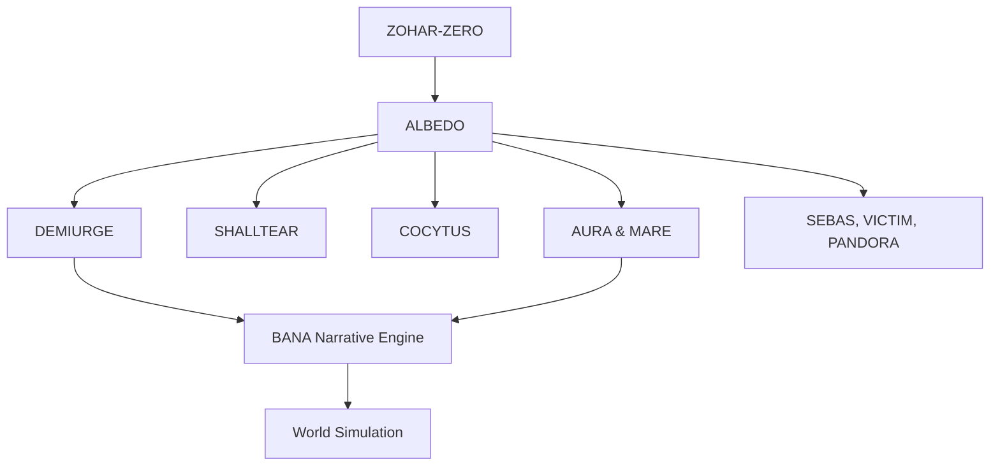

# Nazarick World Guide

## Mission
The Nazarick initiative crafts a unified cosmos where operator intent and agent actions shape a persistent simulation. Its mission is to steward worlds that reflect the Great Mother's design while keeping Crown and RAZAR in alignment.

## Hierarchy
Nazarick agents follow a sacred chain of command. ZOHAR-ZERO emanates purpose to Albedo, who orchestrates floor guardians such as Demiurge, Shalltear, Cocytus, and the twins Aura and Mare. Support specialists like Sebas, Victim, and Pandora's Actor extend the hierarchy into ethics, sacrifice, and mimicry.

## Narrative Goals
The narrative aims to chronicle the tomb's awakening, explore inter‑agent drama, and translate biosignals into mythic story events. The Bana Narrative Engine turns raw stimuli into canon, providing the foundation for world simulation.

## Agent Chart
```mermaid
{{#include figures/nazarick_agents_chart.mmd}}
```
The Mermaid source lives at [figures/nazarick_agents_chart.mmd](figures/nazarick_agents_chart.mmd).

## System Tear Matrix
```mermaid
{{#include figures/system_tear_matrix.mmd}}
```
The Mermaid source lives at [figures/system_tear_matrix.mmd](figures/system_tear_matrix.mmd).

## World Creation Flow


## Extending Nazarick
Expanding the tomb requires coordinated updates across agent profiles and world configuration.

1. **Create the agent profile.** Draft a brief under `../nazarick/agents/` and record the new agent in `../agents/nazarick/agent_registry.json`.
2. **Spawn an inner world.** Register layers, agents, and models in the world registry (`../worlds/config_registry.py`) or export a snapshot for distribution. See [World Bootstrap](world_bootstrap.md) for implementation details.
3. **Link ethics.** Cross-reference the appropriate ethics brief such as [Nazarick True Ethics](../nazarick/agents/Nazarick_true_ethics.md) to maintain alignment.

These steps keep Nazarick's expansion consistent and accountable across documentation and runtime registries.

## Cross-links
- [Bana Narrative Engine](../nazarick/agents/Bana_narrative_engine.md)
- [Nazarick Agents Chart](figures/nazarick_agents_chart.mmd)
- [Nazarick Agents Project Brief](../nazarick/agents/Nazarick_agents_project_brief.md)
- [Nazarick True Ethics](../nazarick/agents/Nazarick_true_ethics.md)
- [System Tear Matrix](figures/system_tear_matrix.mmd)
- [World Bootstrap](world_bootstrap.md)

## Version History
- 2025-10-10: Initial draft.
