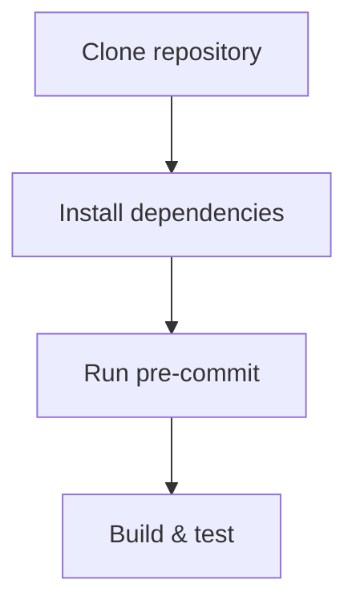

# Onboarding Walkthrough

This walkthrough provides a step-by-step path to set up the repository and rebuild the project from a fresh clone.

## 1. Clone the repository

```bash
git clone https://github.com/DINGIRABZU/ABZU.git
cd ABZU
```

## 2. Install dependencies

```bash
pip install -r requirements.txt
pip install -r dev-requirements.txt
pre-commit install
```

## 3. Run pre-commit on changes

```bash
pre-commit run --files <changed_files>
```

## 4. Build and test

```bash
pytest
```



For additional architecture and design details, consult the [Onboarding Guide](onboarding_guide.md).
