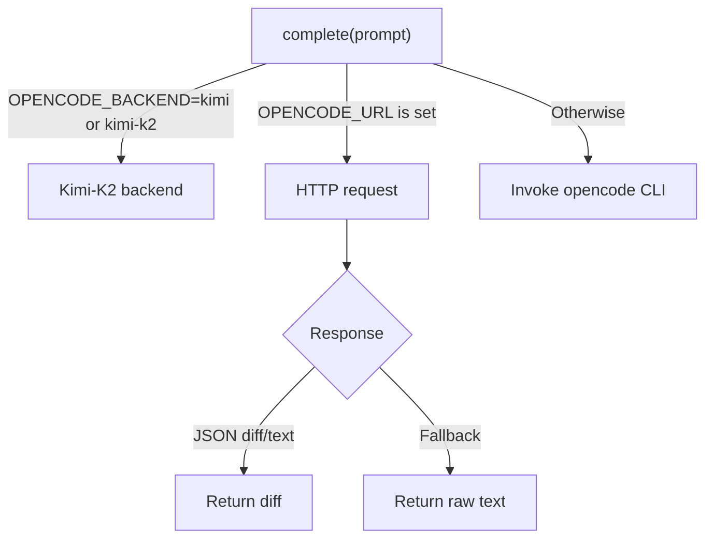

# Opencode Client

## Overview
`tools.opencode_client` provides a unified interface for generating code
edits with the Opencode servant model. It supports three backends
selected through environment variables.

## Backends
### CLI Backend
- Default when no special configuration is set.
- Invokes the local `opencode --diff` command.
- Requires the `opencode` CLI to be installed.

### HTTP Backend
- Activated when `OPENCODE_URL` is defined and the `requests` package is
  available.
- Sends a `POST` request containing the prompt to the specified endpoint
  and returns the `diff` or `text` field from the JSON response.

### Kimi-K2 Backend
- Enabled by setting `OPENCODE_BACKEND` to `kimi` or `kimi-k2`.
- Delegates generation to the Kimi-K2 client for remote execution.

## Decision Flow

## Version History
- v1.0.0 – Initial version.
