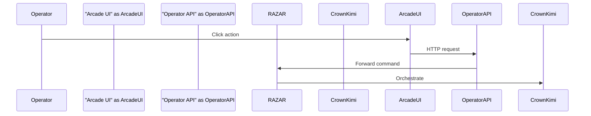
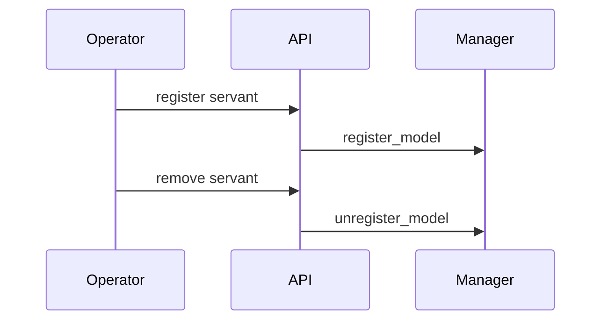

# Operator Console

Arcade-style web interface for issuing commands through the Operator API.

## UI Usage
- Start the Operator API and serve `web_operator/templates/arcade.html` with `arcade.css`.
- A Sumerian greeting modal displays on load.
- **Ignite** sends `/start_ignition`.
- **Query Memory** posts to `/query` with a text payload.
- **Status** retrieves `/status` for component health summaries.

## Environment Variables
- `OPERATOR_API_URL` – base URL of the Operator API (default `http://localhost:8000`).
- `OPERATOR_TOKEN` – Bearer token for secured endpoints.
- `CROWN_URL` – location of Crown/Kimi invoked by RAZAR.

## Integration Flow

## Runtime Model Management
Operators can hot-swap servant models without restarting the console using the Operator API.

- `POST /operator/models` registers a new servant.
- `DELETE /operator/models/{name}` removes one.

## Version History
| Version | Date       | Notes                              |
|---------|------------|------------------------------------|
| 0.3.0   | 2025-11-07 | Document runtime model management  |
| 0.2.0   | 2025-11-06 | Added query endpoint and greeting  |
| 0.1.0   | 2025-11-06 | Initial operator console doc       |
