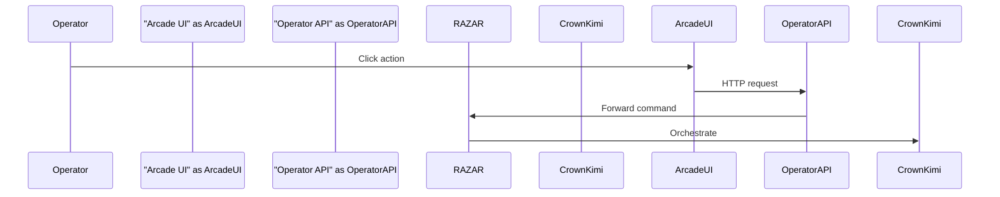
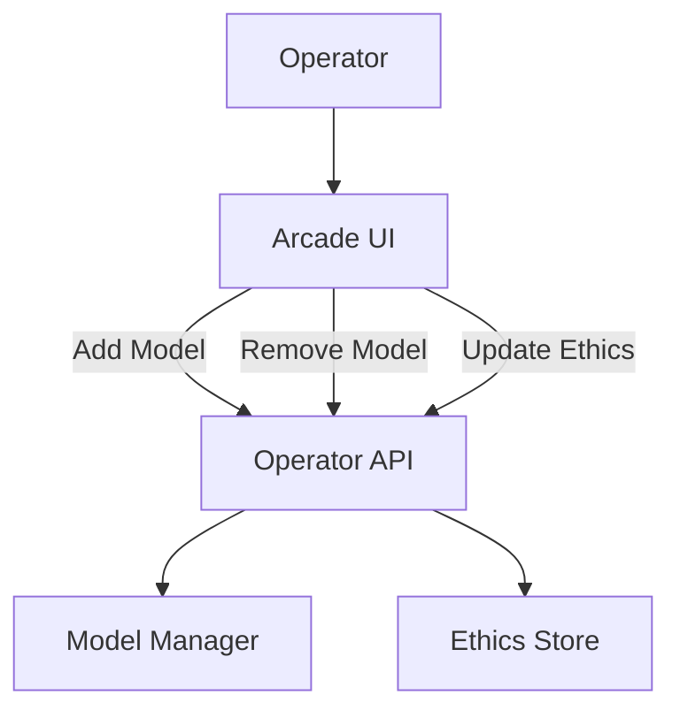

# Operator Console

Arcade-style web interface for issuing commands through the Operator API.

## UI Usage
- Start the Operator API and serve `web_operator/templates/arcade.html` with `arcade.css`.
- A Sumerian greeting modal displays on load.
- **Ignite** sends `/start_ignition`.
 - **Query Memory** posts to `/memory/query` with a text payload.
- **Status** retrieves `/status` for component health summaries.
- **Origin Memory Check** posts to `/memory/query` with the query `ORIGIN DECREE` and renders any snippets. If no results return, reindexing is required.
- **Add Model** posts to `/operator/models` with a model name and builtin.
- **Remove Model** deletes `/operator/models/{name}`.
- **Update Ethics** posts to `/ingest-ethics` to reindex the ethics corpus.

## Environment Variables
- `OPERATOR_API_URL` – base URL of the Operator API (default `http://localhost:8000`).
- `OPERATOR_TOKEN` – Bearer token for secured endpoints.
- `CROWN_URL` – location of Crown/Kimi invoked by RAZAR.

## API Contracts
| Endpoint | Method | Request | Response |
|----------|--------|---------|----------|
| `/start_ignition` | POST | `-` | `{ "status": "started" }` |
| `/memory/query` | POST | `{ "query": "<text>" }` | `{ "results": {...} }` |
| `/handover` | POST | `{ "component": "<name>", "error": "<msg>" }` *(optional)* | `{ "handover": true }` |

## Integration Flow

## Runtime Model & Ethics Management
Operators can hot-swap servant models and refresh ethics alignment without restarting the console using the Operator API.

- `POST /operator/models` registers a new servant.
- `DELETE /operator/models/{name}` removes one.
- `POST /ingest-ethics` reindexes ethics markdown files.

## Roadmap

### Planned Features
- Agent profiles for personalized operator setups.
- Theme customization for the arcade interface.
- World switching to jump between active simulation worlds.

### Dependencies
- Updated memory bundle diagrams to capture cross-world flows.
- Optional layer fallbacks when a world omits specific memory layers.

### Open Questions
- How should agent profiles persist across worlds?
- Which default themes should ship with the console?
- What safeguards are needed when switching worlds mid-session?

## Version History
| Version | Date       | Notes                              |
|---------|------------|------------------------------------|
| 0.5.0   | 2025-11-09 | Document `/start_ignition`, `/memory/query`, and `/handover` API contracts |
| 0.4.0   | 2025-11-08 | Add model, remove model, and ethics update controls |
| 0.3.0   | 2025-11-07 | Document runtime model management  |
| 0.2.0   | 2025-11-06 | Added query endpoint and greeting  |
| 0.1.0   | 2025-11-06 | Initial operator console doc       |
