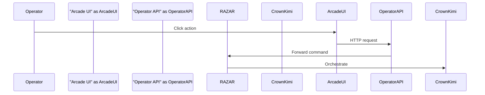

# Operator Console

Arcade-style web interface for issuing commands through the Operator API.

## UI Usage
- Start the Operator API and serve `web_operator/templates/arcade.html`.
- **Ignite** sends `/start_ignition`.
- **Handover** posts to `/handover` with component and error payload.
- **Query Memory** retrieves `/status` for component health and memory summaries.

## Environment Variables
- `OPERATOR_API_URL` – base URL of the Operator API (default `http://localhost:8000`).
- `OPERATOR_TOKEN` – Bearer token for secured endpoints.
- `CROWN_URL` – location of Crown/Kimi invoked by RAZAR.

## Integration Flow

## Version History
| Version | Date       | Notes                       |
|---------|------------|-----------------------------|
| 0.1.0   | 2025-11-06 | Initial operator console doc |
