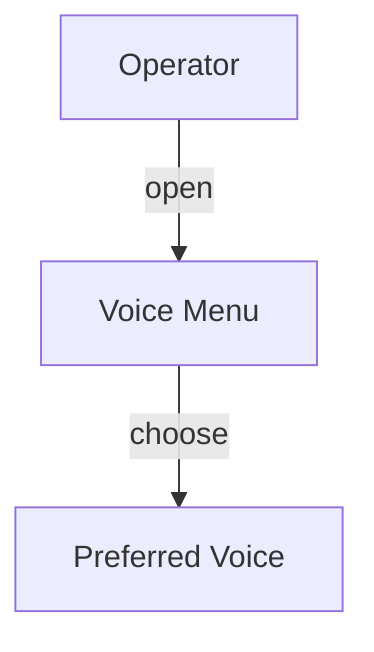
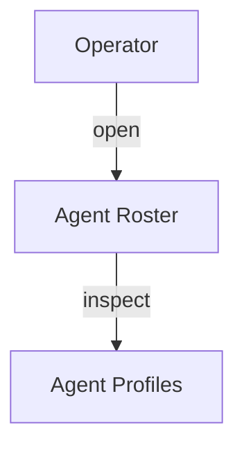

# Operator Interface Guide
Instructions for operator API usage, onboarding requirements, and Nazarick Web Console chat rooms.

## Vision
Defines REST endpoints that let operators control Crown and RAZAR.

## Onboarding
The [The Absolute Protocol](The_Absolute_Protocol.md) requires triple-reading the
[Blueprint Spine](blueprint_spine.md) before contributing. Confirm this review
before operating the interface. See the [Contributor Checklist](contributor_checklist.md)
for error index updates and test requirements.

### Step 1: Select a Voice



### Step 2: Review the Agent Roster



## Architecture
- `/operator/command` forwards actions to RAZAR.
- `/operator/upload` sends files and metadata.
- All requests require Bearer tokens issued by Crown.

## Deployment
Expose the API via the Crown console and export `OPERATOR_TOKEN` for authentication.

### Nazarick Web Console
Access the [Nazarick Web Console](nazarick_web_console.md) to monitor agents and
open their chat rooms. Select an agent to start a room and issue commands
through the Operator API.

## Configuration Schemas
- JSON body: `{ "action": "status", "parameters": {} }`.

## Example Runs
```bash
curl -H "Authorization: Bearer $OPERATOR_TOKEN" \
  -d '{"command":"status"}' \
  localhost:8000/operator/command
```

## Cross-Links
- [Crown Guide](Crown_GUIDE.md)
- [RAZAR Guide](RAZAR_GUIDE.md)
- [Narrative Engine Guide](narrative_engine_GUIDE.md)

## Version History
| Version | Date | Notes |
|---------|------|-------|
| 0.1.0 | 2025-10-17 | Initial operator endpoints. |
