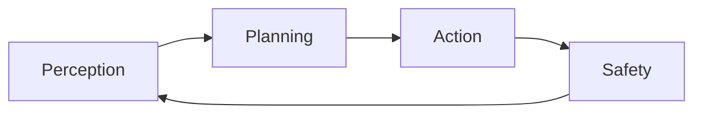

# OS Guardian

Sources: [`../os_guardian/perception.py`](../os_guardian/perception.py), [`../os_guardian/planning.py`](../os_guardian/planning.py), [`../os_guardian/action_engine.py`](../os_guardian/action_engine.py), [`../os_guardian/safety.py`](../os_guardian/safety.py)
Related Guides: [`os_guardian_container.md`](os_guardian_container.md), [`os_guardian_permissions.md`](os_guardian_permissions.md), [`os_guardian_planning.md`](os_guardian_planning.md)

## Vision

Provide a guarded automation layer that interprets instructions and safely
executes actions across the operating system.

## Architecture Diagram



## Requirements

- Python 3.10+
- `pyautogui`, `opencv-python`, and `selenium`
- Optional YOLO models for advanced perception

## Deployment

Install dependencies then launch the CLI:

```bash
pip install -r requirements.txt
python -m os_guardian.cli
```

## Configuration Schemas

- Permission policies: [`os_guardian_permissions.md`](os_guardian_permissions.md)
- Planning settings: [`os_guardian_planning.md`](os_guardian_planning.md)

## Version History

- v0.1.0 – initial modular automation framework

## Example Runs

The OS Guardian coordinates system automation under strict policy control. It
consists of four building blocks:

1. **Perception** – captures the screen and detects interface elements using
   optional OpenCV and YOLO models.
2. **Action engine** – wraps `pyautogui`, shell commands and Selenium to perform
   mouse, keyboard and browser actions.
3. **Planning** – converts natural language instructions into ordered tool calls
   via a small LangChain agent and vector memory.
4. **Safety** – checks permissions for commands, domains and applications while
   tracking undo callbacks.

These modules can be invoked individually or through the `os-guardian` command
line interface.
