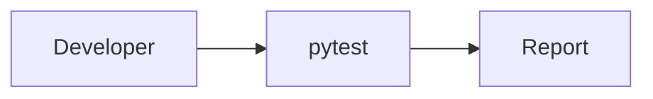

# Testing



## Required pytest plugins

The test suite expects certain plugins to be available:

- `pytest-cov` for coverage reporting via the `--cov` options in `pytest.ini`.

Install them with `pip install -r dev-requirements.txt`.

The project uses a `src` layout. Install the repository in editable mode or
prepend the source path when running tests to avoid import errors:

```bash
pip install -e .
# or
PYTHONPATH=src pytest
```

## Manual smoke tests

### Prioritized test tiers

Execute tests in priority order using the RAZAR runner. The mapping of test
files to tiers lives in `tests/priority_map.yaml`.  Each tier is executed
sequentially with the `pytest-order` plug‑in so critical smoke tests fail fast.
Progress is persisted to `logs/pytest_state.json` so subsequent runs with
`--resume` continue from the last failing tier. Output from every run appends
to `logs/pytest_priority.log`.  A minimal mapping looks like:

```yaml
P1:
  - tests/test_smoke_imports.py
  - tests/test_core_scipy_smoke.py
P2:
  - tests/test_server.py
  - tests/test_api_endpoints.py
```

Run all tiers:

```bash
python agents/razar/pytest_runner.py
```

Run a specific tier:

```bash
python agents/razar/pytest_runner.py --priority P1
```

Resume from the last failing tier:

```bash
python agents/razar/pytest_runner.py --resume
```

If a tier fails the runner sends the failing test context to the CROWN stack for
patch suggestions and invokes the remote code repair agent. The failing module
is patched in a temporary workspace and its tests rerun. Successful patches are
applied to the repository automatically.

### CLI console interface

1. From the repository root, run `python -m cli.console_interface`.
1. Confirm that an interactive prompt (e.g., `INANNA>`) appears and accepts input.
1. Exit with `Ctrl+C` when finished.

### Avatar console

1. Run `bash start_avatar_console.sh`.
   - Ensure `start_crown_console.sh` is executable or invoke it with `bash`.
1. Wait for WebRTC initialization messages in the logs and verify that a video feed is displayed.
1. Use `Ctrl+C` to terminate the services.

## Notes

- During this test run, the CLI setup encountered dependency initialization issues, preventing the prompt from appearing.
- `start_avatar_console.sh` reported a permission error for `start_crown_console.sh` and the WebRTC video stream did not start.

## Common test failure modes

- Missing pytest plugins such as `pytest-cov` will cause command-line options errors. Install required dev dependencies.
- Duplicate or conflicting test module names can trigger collection errors like "import file mismatch". Remove `__pycache__` files or rename tests to be unique.
- ImportError during test collection often indicates missing runtime dependencies or incorrect module paths. Verify imports such as `core.load_config` exist or adjust `PYTHONPATH`.
