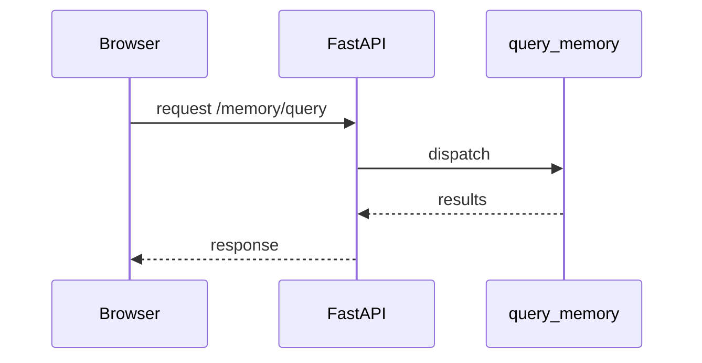

# UI Service

## Overview
The UI Service is a lightweight FastAPI application that renders a browser page and proxies memory queries.
Requests to `/memory/query` are routed through the core `query_memory` helper to aggregate results across memory layers.

## Environment Variables
- `UI_SERVICE_HOST` – network interface to bind (default `0.0.0.0`).
- `UI_SERVICE_PORT` – port that serves HTTP traffic (default `9000`).

## Workflow
1. Export the required environment variables.
2. Launch the server:
   ```bash
   uvicorn ui_service:app --host $UI_SERVICE_HOST --port $UI_SERVICE_PORT
   ```
3. Open a browser to `http://$UI_SERVICE_HOST:$UI_SERVICE_PORT`.
4. Enter a search term; the service returns merged results from the memory layers.



## Startup Narrative
At startup, `start_crown_console.sh` runs `scripts/welcome_banner.py` to show a
cuneiform greeting before the memory bundle initializes.
