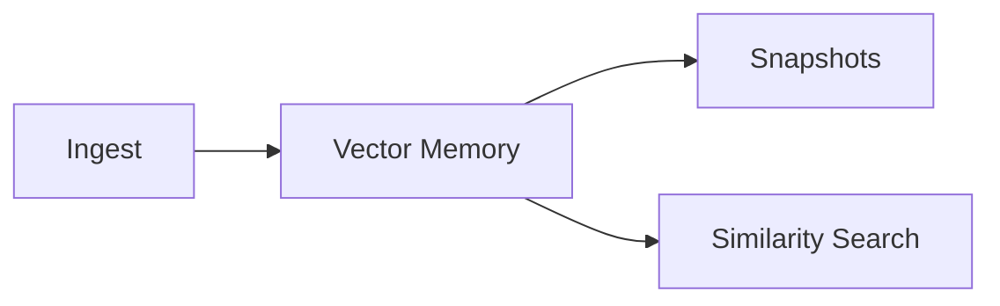

# Vector Memory

Source: [`../vector_memory.py`](../vector_memory.py)
Related Guides: [`rag_pipeline.md`](rag_pipeline.md), [`rag_music_oracle.md`](rag_music_oracle.md)

## Vision

Maintain a persistent, searchable store of embeddings that powers retrieval and
long‑term context tracking for Spiral OS.

## Architecture Diagram



## Requirements

- Python 3.10+
- Optional [FAISS](https://github.com/facebookresearch/faiss) for similarity search
- `sqlite3` and `scikit-learn` for fallback clustering

## Deployment

Import `vector_memory` in your pipeline and configure paths for persistence. The
module has no external services and stores data on the local filesystem.

## Configuration Schemas

- `settings.vector_db_path` – directory for the SQLite database and snapshots
- `snapshot_interval` – number of writes before automatic snapshotting

## Version History

- v0.1.0 – initial extraction from prototype

## Example Runs

### Snapshot persistence

Every write increments an operation counter. When the counter reaches the
configured `snapshot_interval`, the store writes a snapshot to
`settings.vector_db_path/snapshots`. Snapshots can also be managed manually:

```python
from vector_memory import persist_snapshot, restore_latest_snapshot

path = persist_snapshot()           # write a timestamped snapshot
restore_latest_snapshot()           # restore most recent snapshot
```

### Clustering

`cluster_vectors(k)` groups stored embeddings into `k` clusters using FAISS when
available, falling back to scikit-learn's `KMeans`. Each cluster summary contains
the cluster index and number of members.

### Migration Crosswalk

Numeric embedding migration notes live in the [Migration Crosswalk](migration_crosswalk.md#numeric-embeddings).

