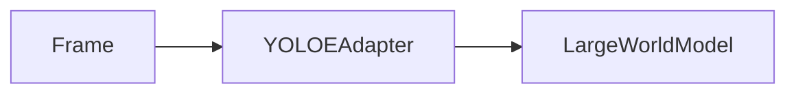

# Vision System

Source: [`../vision/yoloe_adapter.py`](../vision/yoloe_adapter.py)
Related Guides: [`video_generation.md`](video_generation.md)

## Vision

Deliver low‑latency object detection so visual context can inform higher‑level
reasoning.

## Architecture Diagram



## Requirements

- Python 3.10+
- `numpy`, `torch`, and YOLOE weights
- GPU with ≥8 GB VRAM for 640×640 inference

## Deployment

Place YOLOE weights in `vision/` or pass a path when instantiating
`YOLOEAdapter`. The adapter streams detections to `LargeWorldModel`.

## Configuration Schemas

No dedicated schema. Configure weight path and device via constructor
arguments.

## Version History

- v0.1.0 – initial integration of YOLOE adapter

## Example Runs

### YOLOE Features

- **Anchor-free detection** across scales for faster convergence.
- **Decoupled heads** that separate classification and regression for higher
  accuracy.
- **E-ELAN backbone** to improve feature reuse without sacrificing speed.
- Optional plug-in modules for tasks such as segmentation or pose estimation.

### Licensing

YOLOE is distributed under the **AGPL-3.0** license. Using its code or weights
within ABZU requires:

1. Attribution to the original YOLOE authors in documentation or user
   interfaces.
2. Making the source code of any network service that incorporates YOLOE
   available under the same AGPL-3.0 terms.
3. Preserving copyright notices and a copy of the license in all
   distributions.

### Model Weights and GPU Requirements

1. Download the official `yoloe.pt` weights from the upstream repository or
   model zoo.
2. Place the weights under `vision/` or provide the path when creating
   `YOLOEAdapter`.
3. A GPU with **at least 8 GB of VRAM** is recommended for 640×640 inference;
   smaller cards may require lower resolutions.
4. If weights are absent, the adapter falls back to a simple bounding-box
   heuristic.

### Usage

```python
from pathlib import Path
import numpy as np
from vision.yoloe_adapter import YOLOEAdapter
from src.lwm.large_world_model import LargeWorldModel

# Load model and connect to LargeWorldModel
lwm = LargeWorldModel()
adapter = YOLOEAdapter(model_path=Path("yoloe.pt"), lwm=lwm)

# Run detection on a frame
frame = np.load("tests/vision/data/sample_frame.npy")
adapter.detect(frame, frame_id=0)
print(lwm.get_detections())
```

Provide a path to YOLOE weights when available. The adapter falls back to a
simple bounding-box heuristic if the model cannot be loaded.

