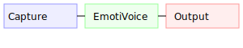

# Voice Aura FX

`audio/voice_aura.py` applies subtle reverb and delay based on the current emotion.
Each emotion maps to a simple preset:

| Emotion  | Reverb | Delay |
|---------|-------|------|
| neutral | 20    | 100  |
| joy     | 30    | 80   |
| excited | 25    | 50   |
| calm    | 50    | 150  |
| sad     | 60    | 200  |
| fear    | 70    | 120  |
| stress  | 40    | 60   |

The module checks if the `sox` command is available to process effects.
If not, it falls back to `pydub`.  Optional RAVE or NSynth checkpoints can
morph the timbre via `dsp_engine.rave_morph` or `nsynth_interpolate`.

## Sample Workflow

Voice capture and synthesis can be driven from either the command line or a
REST interface.

```bash
# record a 2s sample for speaker "alice"
python -m src.cli.voice_clone capture alice.wav --speaker alice --seconds 2

# synthesize text using the recorded sample
python -m src.cli.voice_clone synthesize "Hello" out.wav --sample alice.wav --speaker alice --emotion joy
```

The FastAPI server exposes matching endpoints:

- `POST /voice/capture` – records a sample on the host.  Parameters: `speaker`,
  `seconds`, `sr` and `path`.
- `POST /voice/synthesize` – generates speech for `text` with optional
  `emotion` and `speaker` fields.



These utilities handle missing optional dependencies such as `sounddevice` and
`EmotiVoice` gracefully, returning informative errors when unavailable.

